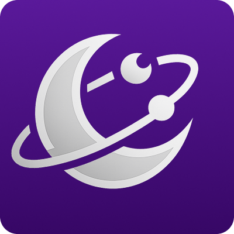
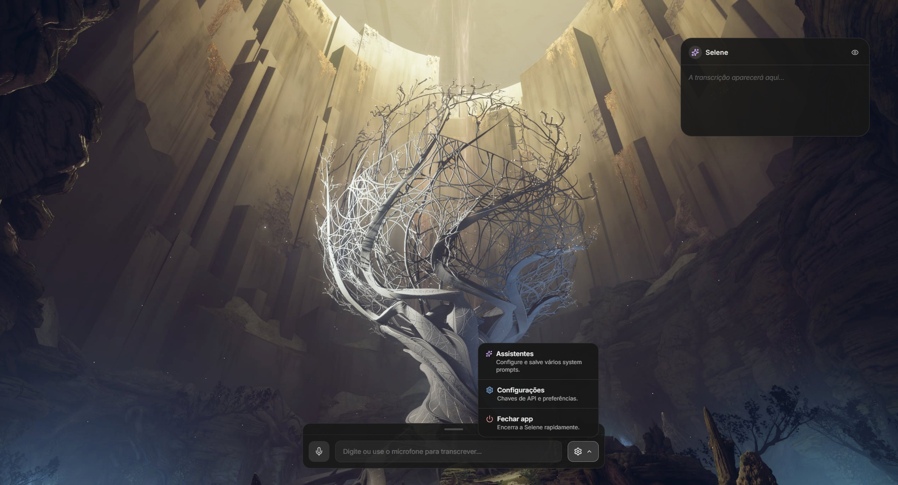
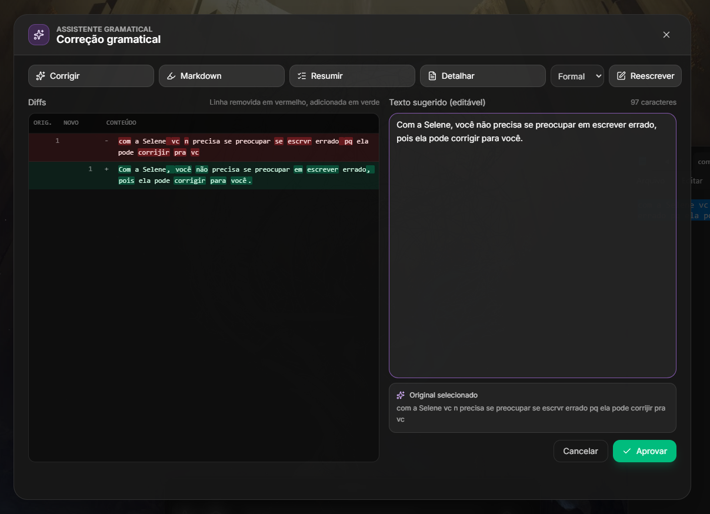
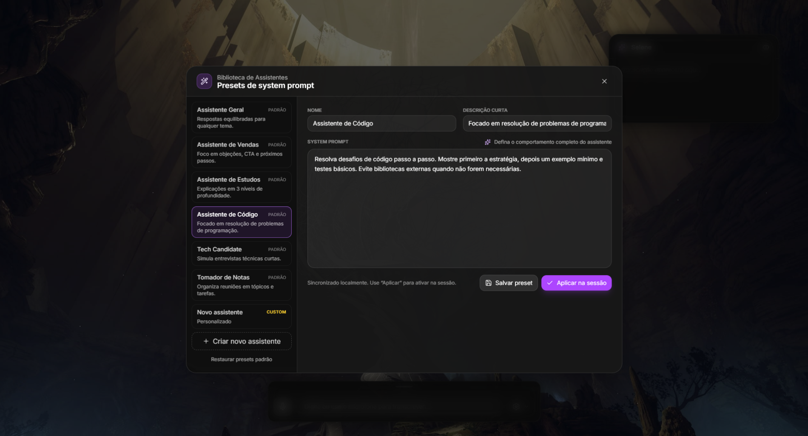
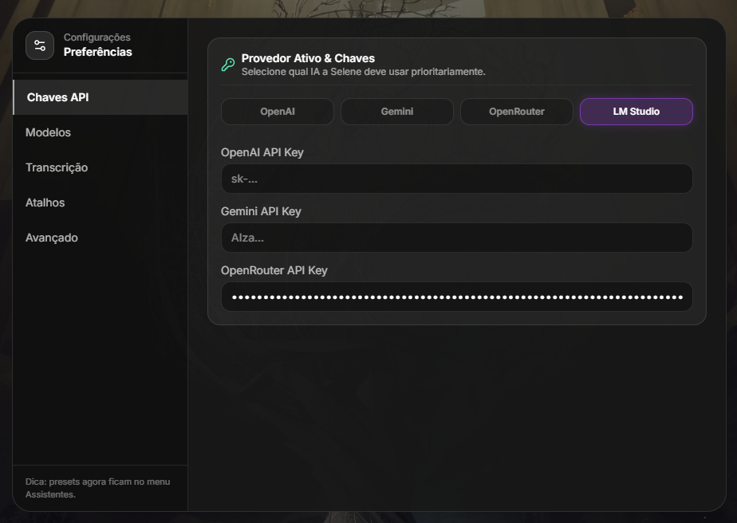

# Selene - AI Assistant Overlay

<div align="center">
  
  <h1>Selene</h1>
  <p><strong>Desperte a Inteligência no seu Desktop</strong></p>
  
  [](LICENSE.md)
  [](https://react.dev)
  [](https://www.electronjs.org/)
  [](https://www.typescriptlang.org/)
  [](https://github.com/levigarciia/Selene)
</div>

---

**Selene** é um assistente de desktop futurista e onipresente projetado para ser seu segundo cérebro. O código-fonte é público e desenvolvido no **Brasil** 🇧🇷.
Funciona como um overlay transparente e interativo que flutua sobre suas janelas, oferecendo inteligência artificial instantânea sem interromper seu fluxo de trabalho.



## ✨ Funcionalidades Principais

### 🖱️ Overlay Transparente Inteligente

A interface flutua sobre o Windows. Widgets ficam interativos automaticamente quando você passa o mouse, enquanto o resto da tela permanece "clicável" (click-through). Implementado via polling de posição de mouse a 10Hz no processo principal do Electron.

### 🗣️ Comandos de Voz

Transcrição de áudio em tempo real usando:

- **Whisper** (OpenAI)
- **Gemini Flash** (Google)

### 🧠 Multi-Modelo

Suporte nativo para múltiplos provedores de IA:

- **OpenAI** (GPT-5.2, GPT-4o)
- **Google Gemini** (3 Pro, 2.5 Flash)
- **LM Studio** (Modelos locais via API compatível)
- **OpenRouter**

### ✍️ Assistente Gramatical Global

Selecione qualquer texto em qualquer aplicativo, pressione `Ctrl+Alt+X` e a Selene irá corrigir, resumir ou reescrever o texto instantaneamente em uma janela dedicada.



### 🤖 Personas Personalizáveis

Crie "Agentes" com prompts de sistema específicos (ex: "Programador Senior", "Tradutor", "Revisor") e alterne entre eles rapidamente.



### 🧠 Sistema de Memória Inteligente

- **Memória Persistente**: Perfil do usuário e memórias manuais.
- **Cross-Chat Context**: Recuperação automática de contexto relevante de conversas anteriores via busca semântica.
- **Memory Autopilot**: Extração automática de preferências e contexto recorrente das conversas.

### 🎨 Design Premium

Interface moderna com:

- Glassmorphism
- Animações suaves (Framer Motion)
- Modo escuro nativo
- Scrollbars customizadas

### 🔄 Auto-Update

Atualizações automáticas silenciosas quando disponíveis via `electron-updater`.

---

## 📥 Download

Baixe a versão mais recente na [página de Releases](https://github.com/levigarciia/Selene/releases):

| Plataforma            | Download                     |
| --------------------- | ---------------------------- |
| Windows (64-bit)      | `Selene-x.x.x-win-x64.exe`   |
| macOS (Intel)         | `Selene-x.x.x-mac-x64.dmg`   |
| macOS (Apple Silicon) | `Selene-x.x.x-mac-arm64.dmg` |

> **Nota macOS**: A versão para Mac pode não estar notarizada. Clique com botão direito > "Abrir" na primeira execução, ou vá em Preferências do Sistema > Segurança e Privacidade para permitir.

---

## 🚀 Instalação e Uso (Desenvolvimento)

### Pré-requisitos

- Node.js (v18 ou superior)
- npm ou yarn

### Passos

1. **Clone o repositório:**

   ```bash
   git clone https://github.com/levigarciia/Selene.git
   cd Selene
   ```

2. **Instale as dependências:**

   ```bash
   npm install
   ```

3. **Inicie em modo de desenvolvimento:**

   ```bash
   npm run dev
   ```

   Isso abrirá a janela do Electron com Hot-Reload ativo. O servidor Vite roda em `http://localhost:5173`.

4. **Build para Produção:**

   ```bash
   npm run build
   ```

   O build será compilado em `dist` (React/Vite) e `dist-electron` (Electron main/preload).

5. **Criar Instalador Local:**
   ```bash
   npm run dist           # Detecta o sistema automaticamente
   npm run dist:win       # Apenas Windows
   npm run dist:mac       # Apenas macOS
   npm run dist:linux     # Apenas Linux
   ```
   O instalador será gerado na pasta `release/`.

---

## ⚙️ Configuração

Ao abrir a Selene, clique no ícone de **Engrenagem** na barra de ferramentas ou no ChatWindow para acessar as configurações:

- **Chaves de API**: Insira suas chaves da OpenAI, Google Gemini ou OpenRouter.
- **Provedor Ativo**: Selecione qual provedor de IA usar.
- **Modelos Locais**: Configure a URL base e o ID do modelo para conectar com LM Studio.
- **Atalhos**: Configure o atalho global para o Assistente Gramatical (Padrão: `Ctrl+Alt+X`) e Screenshot (Padrão: `Ctrl+Alt+S`).
- **Perfil do Usuário**: Nome, ocupação e informações "sobre mim" para personalização.
- **Memórias**: Adicione memórias manuais para contextualizar a IA.
- **Atualizações Automáticas**: Habilite ou desabilite no painel "Avançado".

> **Nota**: As configurações são salvas localmente via `localStorage`.



---

## 🔄 Atualizações Automáticas

Selene suporta atualizações automáticas silenciosas:

1. **Habilitar**: Vá em Configurações > Avançado > ative "Atualizações automáticas"
2. **Comportamento**:
   - O app verifica por atualizações no boot e periodicamente
   - Downloads são feitos em segundo plano
   - Quando pronto, você será notificado para reiniciar
3. **Desabilitar**: Desative o toggle para controle manual

---

## 📦 Criando um Release

### Fluxo de Versionamento

O projeto segue [Semantic Versioning](https://semver.org/):

- **MAJOR**: Mudanças incompatíveis na API
- **MINOR**: Novas funcionalidades retrocompatíveis
- **PATCH**: Correções de bugs retrocompatíveis

### Passo a Passo para Release

1. **Atualize a versão no `package.json`:**

   ```bash
   npm version patch  # 0.1.0 -> 0.1.1
   npm version minor  # 0.1.1 -> 0.2.0
   npm version major  # 0.2.0 -> 1.0.0
   ```

2. **Commit das mudanças:**

   ```bash
   git add .
   git commit -m "chore: bump version to X.Y.Z"
   ```

3. **Crie e push a tag:**

   ```bash
   git tag -a v0.2.0 -m "Release v0.2.0: Nova funcionalidade XYZ"
   git push origin v0.2.0
   ```

4. **Aguarde o GitHub Actions:**

   - O workflow `release.yml` será disparado automaticamente
   - Builds para Windows e macOS serão criados
   - Um Release será publicado com todos os assets

5. **Verifique o Release:**
   - Acesse [Releases](https://github.com/levigarciia/Selene/releases)
   - Confirme que todos os arquivos estão presentes

---

## 🔐 Code Signing (Opcional)

Para builds assinados (remove avisos de segurança):

### macOS

1. Obtenha um certificado Apple Developer (requer conta paga)
2. Configure os secrets no GitHub:
   - `CSC_LINK`: Certificado .p12 em Base64
   - `CSC_KEY_PASSWORD`: Senha do certificado
   - `APPLE_ID`, `APPLE_ID_PASSWORD`, `APPLE_TEAM_ID`

### Windows

1. Obtenha um certificado de code signing (DigiCert, Sectigo)
2. Configure os secrets:
   - `WINDOWS_CSC_LINK`: Certificado .pfx em Base64
   - `WINDOWS_CSC_KEY_PASSWORD`: Senha do certificado

---

## 🤝 Contribuição

Contribuições são bem-vindas! Consulte os guias abaixo:

- [CONTRIBUTING.md](CONTRIBUTING.md) - Guia geral de contribuição.
- [docs/AGENTS.md](docs/AGENTS.md) - **Leitura obrigatória para Agentes de IA** trabalhando neste código.
- [docs/CLAUDE.md](docs/CLAUDE.md) - Orientações específicas para o assistente Claude.

---

## 🛠️ Tecnologias

| Tecnologia           | Uso                                          |
| -------------------- | -------------------------------------------- |
| **Electron**         | Janelas e integração com sistema operacional |
| **React + Vite**     | Interface de usuário rápida e reativa        |
| **TypeScript**       | Tipagem estática para robustez               |
| **TailwindCSS**      | Estilização utilitária e moderna             |
| **Framer Motion**    | Animações fluidas                            |
| **electron-builder** | Empacotamento e distribuição                 |
| **electron-updater** | Atualizações automáticas                     |

---

## 📁 Estrutura do Projeto

```
Selene/
├── electron/                  # Código do processo main do Electron
│   ├── main.ts               # Entry point - gerencia janelas, atalhos globais, mouse polling
│   ├── preload.ts            # Script de preload (contextBridge para API segura)
│   └── updater.ts            # Módulo de auto-update
├── src/                       # Código do React (renderer process)
│   ├── App.tsx               # Componente raiz do overlay
│   ├── main.tsx              # Entry point do React
│   ├── components/           # Componentes React
│   │   ├── ChatWindow.tsx    # Janela principal de chat
│   │   ├── BottomToolbar.tsx # Barra de ferramentas flutuante
│   │   ├── FloatingModal.tsx # Modal de chat flutuante
│   │   └── ModalConfiguracoes.tsx # Painel de configurações
│   ├── hooks/                # Custom hooks
│   │   ├── useAI.ts          # Hook para serviço de IA
│   │   ├── useAudio.ts       # Hook para gravação de áudio
│   │   ├── useCrossChatContext.ts # Hook para contexto entre conversas
│   │   └── useMemoryAutopilot.ts  # Hook para memória automática
│   ├── services/             # Serviços e lógica de negócio
│   │   ├── AIService.ts      # Camada de abstração para provedores de IA
│   │   ├── ai/               # Implementações de provedores (OpenAI, Gemini, etc.)
│   │   ├── memory/           # Sistema de memória automática
│   │   ├── crosschat/        # Sistema de contexto entre conversas
│   │   └── PromptPipeline.ts # Composição de prompts
│   ├── windows/              # Janelas especializadas
│   │   └── GrammarWindow.tsx # Janela do assistente gramatical
│   └── types/                # Definições de tipos TypeScript
├── public/                   # Assets estáticos
├── build-resources/          # Recursos para build (entitlements, etc.)
├── docs/                     # Documentação adicional
│   ├── AGENTS.md             # Guia para agentes de IA
│   ├── CLAUDE.md             # Guia específico para Claude
│   └── MEMORY_ARCHITECTURE.md # Arquitetura do sistema de memória
├── .github/workflows/        # GitHub Actions
│   └── release.yml           # Workflow de release automatizado
├── dist/                     # Build do Vite (gerado)
├── dist-electron/            # Build do Electron (gerado)
├── release/                  # Instaladores (gerado)
└── package.json              # Configuração e scripts
```

---

## 📄 Licença

> **⚠️ Importante**: Selene é **source-available** (código-fonte disponível), mas **não é open source** segundo a definição da [Open Source Initiative (OSI)](https://opensource.org/osd).

### ✅ O que você PODE fazer:

- **Uso pessoal**: Executar Selene em seu computador para uso próprio
- **Uso educacional**: Estudar o código, usar em projetos acadêmicos, ensinar
- **Pesquisa**: Usar para pesquisa não-comercial e publicações acadêmicas
- **Contribuir**: Enviar melhorias e correções para o projeto oficial

### ❌ O que você NÃO pode fazer:

- **Uso comercial**: Usar Selene em atividades que gerem receita ou lucro
- **SaaS**: Oferecer Selene como serviço hospedado para terceiros
- **Distribuição comercial**: Vender, licenciar ou sublicenciar Selene
- **Patentes**: Registrar patentes baseadas no código ou conceitos do Selene

### 🔐 Direitos do Autor

O autor original (Levi Garcia) mantém todos os direitos sobre o projeto, incluindo o direito de:

- Usar comercialmente
- Criar versões comerciais
- Licenciar para terceiros sob termos diferentes

### 💼 Licenciamento Comercial

Se você deseja usar Selene comercialmente, entre em contato: **levigarcia878@gmail.com**

> Versões comerciais com funcionalidades adicionais podem ser disponibilizadas no futuro.

Veja o arquivo [LICENSE.md](LICENSE.md) para os termos completos.

---

## 👨‍💻 Autor

**Levi Garcia**

- Email: levigarcia878@gmail.com
- GitHub: [@levigarciia](https://github.com/levigarciia)
