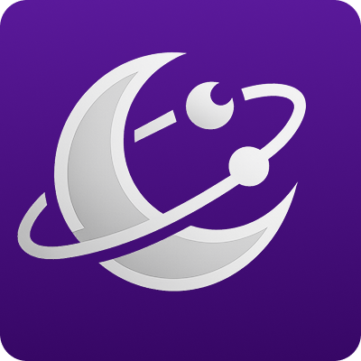
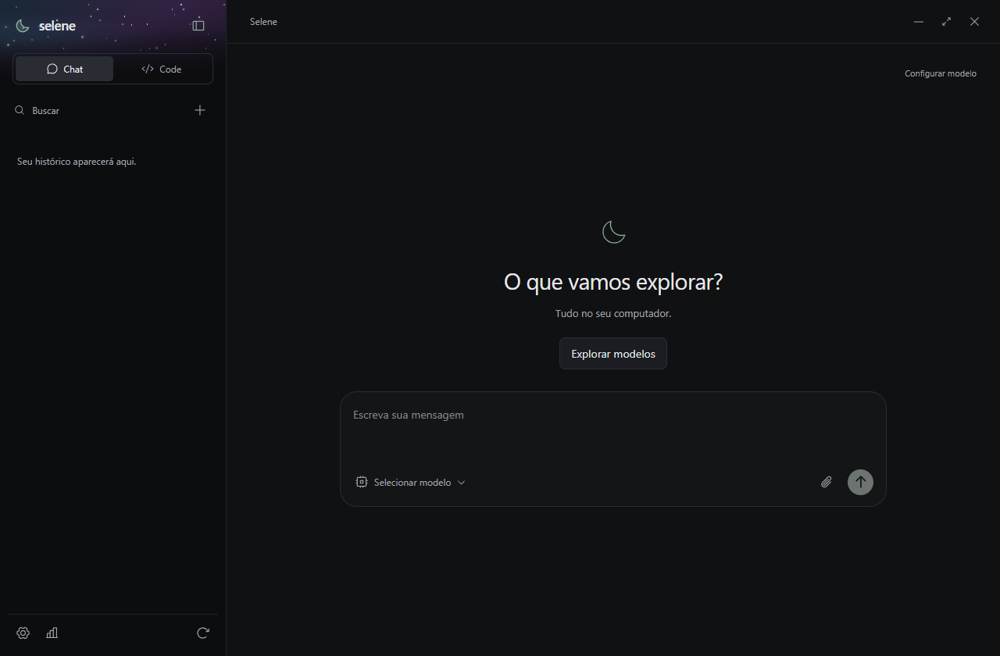
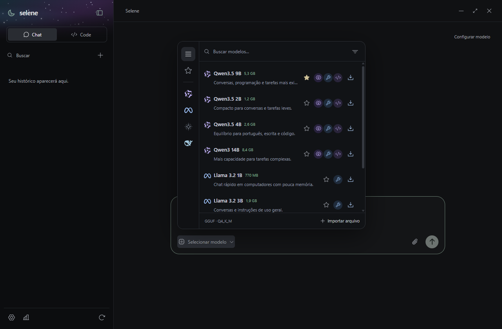

    
    <h1>Selene</h1>
    
<strong>Sua inteligência artificial. No seu computador.</strong>

    
Converse, explore ideias e trabalhe nos seus projetos com uma assistente local.

    
      
    
    
    

 

A **Selene** é uma assistente de inteligência artificial que roda no seu computador.
Use o **Chat** para conversar, estudar e explorar ideias, ou o **Code** para trabalhar com arquivos e projetos.
Sem assinatura de IA e sem precisar configurar uma chave de API para começar.

## Converse do seu jeito

Faça perguntas, organize ideias, peça explicações e volte às suas conversas quando quiser.
A Selene guarda seu histórico no computador e permite pesquisar, renomear e exportar conversas.

Você também pode anexar imagens para conversar sobre elas com um modelo que tenha suporte visual.

## Uma ajuda para os seus projetos

No modo **Code**, escolha uma pasta e peça ajuda para entender arquivos, criar código ou fazer alterações.
Acompanhe o plano, as ações e os resultados na própria conversa.

Você decide o que pode ser executado. A Selene pede aprovação para alterações e comandos,
ou você pode ativar o acesso completo naquela conversa.

## Escolha sua inteligência artificial

Explore o catálogo, encontre um modelo que combine com seu computador e baixe pela própria Selene.
Você pode acompanhar o progresso, cancelar um download e salvar seus favoritos.
Já tem um modelo? Importe seu arquivo GGUF.

    &nbsp;&nbsp;&nbsp;
    &nbsp;&nbsp;&nbsp;
    &nbsp;&nbsp;&nbsp;
    

A Selene escolhe o processamento adequado para o seu computador.
Modelos menores são uma boa opção para começar; modelos maiores precisam de mais memória.

## Tudo no seu computador

As conversas e a execução dos modelos ficam no seu dispositivo.
Depois de baixar o modelo e preparar o motor, você pode conversar sem internet.
A conexão é usada para baixar modelos, preparar o motor e receber atualizações.

## Comece em poucos passos

1. [Baixe a Selene para Windows](https://github.com/levigarciia/Selene/releases/latest) e execute o instalador.
2. Abra a Selene e clique em **Explorar modelos**.
3. Baixe e selecione um modelo.
4. Envie sua primeira mensagem. A Selene prepara o necessário automaticamente.

Disponível para **Windows de 64 bits**. Você não precisa instalar ferramentas de programação.
Como o instalador ainda não tem assinatura digital, o Windows pode pedir uma confirmação na primeira execução.

## Sempre atualizada

A versão instalada busca e baixa novidades automaticamente.
Ao fechar a Selene, a atualização é instalada para o próximo uso, sem interromper sua conversa.
Você pode acompanhar o andamento em **Configurações**, na área **Geral**.

## Já usava a Selene?

Esta é uma nova versão, refeita desde o início e focada em Chat e Code com modelos locais.
Os recursos da versão anterior ainda não estão todos disponíveis, e as conversas antigas não são importadas
automaticamente. Seus dados antigos permanecem no computador.

Se as atualizações automáticas estavam ativadas na versão anterior, ela pode receber esta versão.
Caso contrário, basta baixar e instalar a versão atual.
A versão anterior continua disponível na branch [old](https://github.com/levigarciia/Selene/tree/old)
e nas releases antigas.

## Sobre o projeto

Desenvolvida no Brasil por [Levi Garcia](https://github.com/levigarciia).
O código está disponível para consulta, com uso pessoal, educacional e de pesquisa conforme a
[licença da Selene](LICENSE.md).

Para informações de desenvolvimento, consulte a [documentação técnica](docs/DESENVOLVIMENTO.md).
