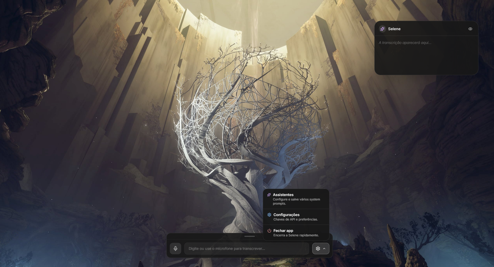
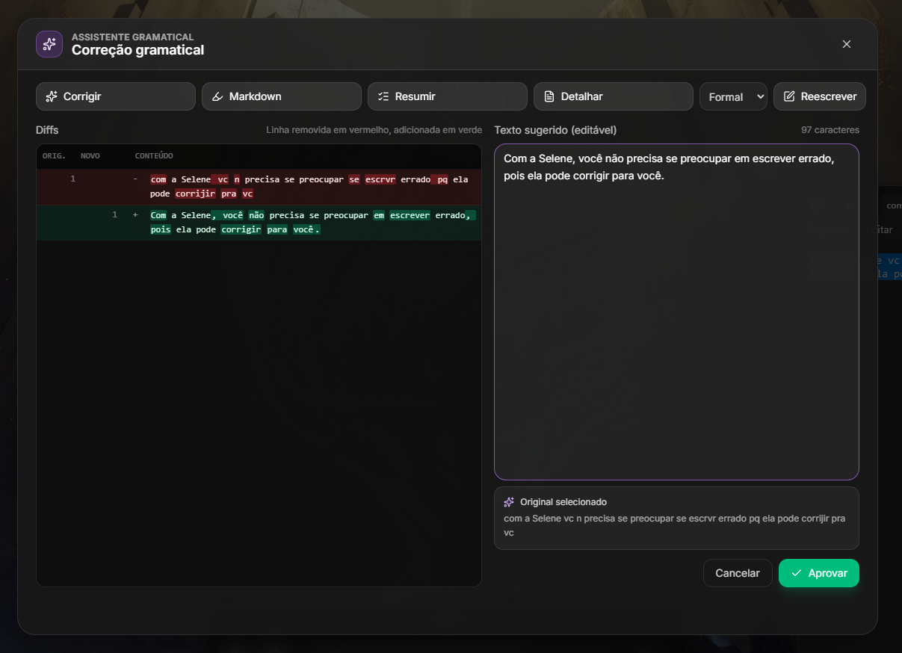
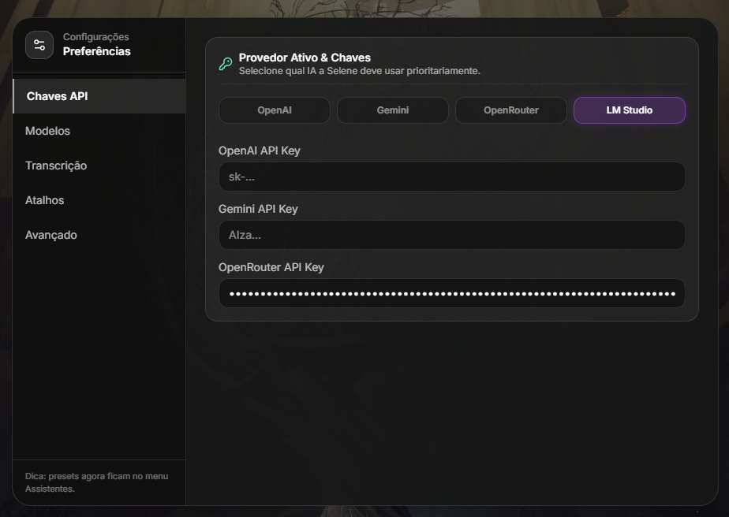

# Selene

<div align="center">
  
  <h1>Selene</h1>
  <p><strong>Assistente de IA para o seu desktop</strong></p>

  [](LICENSE.md)
  [](https://react.dev)
  [](https://www.electronjs.org/)
  [](https://www.typescriptlang.org/)
  [](https://github.com/levigarciia/Selene)
</div>

---

**Selene** é uma assistente de desktop feita em `Electron + React + TypeScript`.
Ela combina overlay transparente, chat dedicado, assistente gramatical global, voz, memória, busca web,
ferramentas locais e integração MCP para ajudar sem tirar você do fluxo de trabalho.

O código-fonte é público, source-available e desenvolvido no Brasil.



## Funcionalidades

### Overlay transparente

A Selene roda sobre a área de trabalho como um overlay de tela cheia com click-through. Os blocos interativos
recebem foco quando necessário, enquanto o restante da tela continua clicável.

### Chat dedicado

O chat tem janela própria, conversas persistidas, projetos, contexto por arquivos, anexos multimodais, citações,
ações rápidas e trilha de raciocínio quando o provedor suporta esse fluxo.

### Assistente gramatical global

Selecione texto em qualquer aplicativo e use o atalho configurado para corrigir, resumir, detalhar, reescrever ou
converter para Markdown.



### Voz e transcrição

A entrada por voz pode usar provedores em nuvem ou motores locais:

- OpenAI Whisper
- Google Gemini
- Groq
- Whisper local
- Parakeet local

### Provedores de IA

A Selene suporta diferentes provedores e perfis de latência:

- OpenAI
- Google Gemini
- OpenRouter
- LM Studio ou outro endpoint local compatível

### Memória e contexto

- Perfil do usuário e memórias manuais.
- `Cross-Chat Context` para recuperar contexto relevante de conversas anteriores.
- `Memory Autopilot` para extrair preferências e fatos recorrentes.
- Projetos com instruções e arquivos próprios.

### Ferramentas, MCP e investigação

O chat possui tool calling com ferramentas nativas, busca web, leitura de arquivos do projeto, modo de investigação
com checkpoints e integração com servidores MCP.

### Overlay proativo

O overlay inteligente pode observar contexto e voz para sugerir ajuda quando detectar travamento, dúvida clara ou
oportunidade de ação. Ele pode ser pausado, dispensado ou expandido para o chat.

### Atualizações automáticas

O app usa `electron-updater` para verificar, baixar e instalar novas versões publicadas no GitHub Releases.



## Download

Baixe a versão mais recente em [GitHub Releases](https://github.com/levigarciia/Selene/releases).

| Plataforma | Artefato |
| --- | --- |
| Windows x64 | `Selene-x.x.x-win-x64.exe` |
| macOS Intel | `Selene-x.x.x-mac-x64.dmg` ou `.zip` |
| macOS Apple Silicon | `Selene-x.x.x-mac-arm64.dmg` ou `.zip` |
| Linux x64 | `Selene-x.x.x-linux-x64.AppImage` |
| Linux x64 Deb | `Selene-x.x.x-linux-x64.deb` |

No macOS, a versão distribuída pode exigir liberação manual na primeira execução.
No Linux, o AppImage pode precisar de permissão de execução:

```bash
chmod +x Selene-*.AppImage
```

## Configuração

As configurações ficam salvas localmente no computador. A janela de configurações organiza o app nestas seções:

| Seção | O que configura |
| --- | --- |
| Perfil | Nome, ocupação e dados usados para personalização |
| IA | Chaves, provedor ativo, modelos e perfil de latência |
| Personalização | Memórias manuais, memórias automáticas e contexto entre conversas |
| Voz | Provedor de transcrição, motor local, modelo e microfone |
| Avançado | Overlay proativo, atalhos globais, versão e auto-update |

## Desenvolvimento

### Requisitos

- Node.js 20 ou superior
- Bun instalado globalmente
- Git

### Instalação

```bash
git clone https://github.com/levigarciia/Selene.git
cd Selene
bun install
```

### Rodar em desenvolvimento

```bash
bun run dev
```

O Vite roda em `http://localhost:5173` e o Electron abre a aplicação em modo de desenvolvimento.

### Verificações úteis

```bash
bun run lint
bun run build
```

### Gerar instaladores

```bash
bun run dist
bun run dist:win
bun run dist:mac
bun run dist:linux
```

Os artefatos são gerados em `release/`.

> Observação: alguns scripts internos do `package.json` ainda chamam ferramentas via comandos legados. Para uso direto
> no projeto, prefira sempre `bun run ...`.

## Estrutura do projeto

```text
electron/
├── main.ts                 # Janelas, tray, atalhos globais e click-through
├── preload.ts              # Ponte segura para window.electronAPI
├── updater.ts              # Auto-update
├── web-search.ts           # Busca web no processo principal
├── mcp/                    # IPC e integração MCP
├── local-whisper/          # Transcrição local com Whisper
└── local-parakeet/         # Transcrição local com Parakeet

src/
├── App.tsx                 # Overlay raiz
├── components/
│   ├── config/             # Configurações
│   ├── toolbar/            # Barra flutuante
│   └── windows/            # Chat e assistente gramatical
├── hooks/                  # Estado de app, voz, atalhos, memória e overlay
├── services/
│   ├── ai/                 # Providers de IA
│   ├── tools/              # Tool calling e ferramentas nativas
│   │   └── MCPToolBridge.ts # Ponte de ferramentas MCP via Electron
│   ├── investigate/        # Modo de investigação
│   ├── crosschat/          # Busca semântica entre conversas
│   ├── memory/             # Memória persistente
│   └── whisper/            # Camada de transcrição
└── types/                  # Tipos compartilhados

docs/
├── AGENTS.md               # Guia operacional para agentes de IA
├── CLAUDE.md               # Guia específico para Claude
└── PHILOSOPHY.md           # Linguagem visual da Selene
```

## Tecnologias

| Tecnologia | Uso |
| --- | --- |
| Electron | Integração com o sistema operacional e janelas nativas |
| React + Vite | Interface do renderer |
| TypeScript | Tipagem e contratos entre camadas |
| Tailwind CSS | Estilização utilitária |
| Framer Motion | Transições e microinterações |
| electron-builder | Empacotamento |
| electron-updater | Atualizações automáticas |
| Vitest | Testes unitários |

## Contribuição

Antes de contribuir, leia:

- [CONTRIBUTING.md](CONTRIBUTING.md)
- [CHANGELOG.md](CHANGELOG.md)
- [docs/AGENTS.md](docs/AGENTS.md)
- [docs/PHILOSOPHY.md](docs/PHILOSOPHY.md)

Use TypeScript, preserve os contratos entre `electron/main.ts`, `electron/preload.ts` e o renderer, e tenha cuidado
especial com o fluxo de click-through do overlay.

## Licença

> Selene é **source-available**: o código-fonte está disponível, mas o projeto não é open source segundo a definição
> da [Open Source Initiative](https://opensource.org/osd).

Você pode usar, estudar e contribuir com o projeto para fins pessoais, educacionais e de pesquisa não comercial.

Você não pode vender, sublicenciar, oferecer como SaaS, usar comercialmente ou registrar patentes baseadas no código
ou nos conceitos da Selene.

Para uso comercial, entre em contato: **contato@kitelabs.com**.

Veja os termos completos em [LICENSE.md](LICENSE.md).

## Autor

**Levi Garcia**

- Email: contato@kitelabs.com
- GitHub: [@levigarciia](https://github.com/levigarciia)
